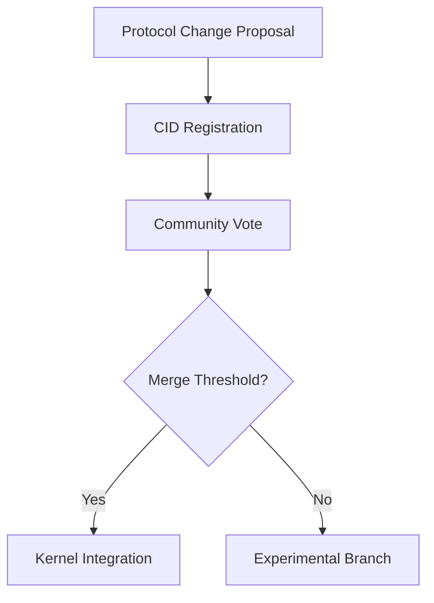

# PromiseGrid Universal Message Routing Protocol

## Core Message Structure
The protocol defines a minimalist grid-inspired message format enabling secure multi-hop routing while maintaining cryptographic integrity across diverse network topologies. Messages follow content-addressable principles using multihash identifiers for all critical components.

```go
type PromiseGridMessage struct {
    Protocol    MultihashDigest `cbor:"0,keyasint"`  // Protocol version hash
    Length      uint32          `cbor:"1,keyasint"`  // Total message bytes
    Routing     CID             `cbor:"2,keyasint"`  // Content-addressable routing spec
    Payload     []byte          `cbor:"3,keyasint"`  // Encrypted payload
    Resources   ResourceSpec    `cbor:"4,keyasint"`  // Bid/ask resource requirements
    Signature   []byte          `cbor:"5,keyasint"`  // Author's ed25519 signature
}

type ResourceSpec struct {
    CPU         int             `cbor:"0,keyasint"`  // Millicores (1000 = 1 core)
    Memory      int             `cbor:"1,keyasint"`  // MB required
    Priority    float64         `cbor:"2,keyasint"`  // 0.0-1.0 urgency
}

// Multihash implementation using 256-bit Blake3
type MultihashDigest struct {
    Code   uint64 // 0x1e for Blake3-256
    Length uint8  // 0x20 for 32 bytes
    Digest []byte `cbor:"size=32"` 
}
```

## Adaptive Routing Algorithm
The routing process combines bloom filters for fast preliminary matching with capability-based authorization checks, enabling sub-millisecond decisions on resource-constrained devices.

```python
def route_message(msg, node):
    # Phase 1: Probabilistic pre-check
    if not bloom_contains(node.subscription_filter, msg.Routing):
        return None

    # Phase 2: Capability verification
    required_caps = decode_capabilities(msg.Routing)
    if not validate_capabilities(node.token, required_caps):
        return None

    # Phase 3: Resource bid matching
    if msg.Resources.Priority > 0.8:
        if not check_urgent_resources(node, msg.Resources):
            return defer_to_neighbors(msg)

    # Phase 4: Temporal difference learning update
    update_routing_weights(node.learning_model, msg)

    return apply_merge_policy(node, msg)

def bloom_contains(filter, cid):
    # Implementation using 3-stage folded bloom filter
    h1 = blake3(cid).digest()[0:4]
    h2 = blake3(cid).digest()[4:8]
    h3 = blake3(cid).digest()[8:12]
    return (filter & h1) | (filter & h2) | (filter & h3)
```

## WASM Host Environment Requirements
The kernel exposes critical services to WASM-based agents through a minimal set of imported functions:

```rust
// Content addressing primitives
fn pg_store(data: &[u8]) -> CID;
fn pg_retrieve(cid: CID) -> Option<Vec<u8>>;

// Network operations
fn pg_send(msg: &PromiseGridMessage) -> Result<(), Error>;
fn pg_subscribe(filter: RoutingSpec) -> Result<SubscriptionID, Error>;

// Resource negotiation
fn pg_request(cpu_millicores: u32, mem_mb: u32) -> Result<ResourceTicket, Error>;
fn pg_bid_ask_market(ask: ResourceSpec) -> Option<BidResponse>;

// Consensus operations
fn pg_merge(a: CID, b: CID) -> Result<CID, MergeError>;
fn pg_vote(proposal: CID) -> Result<GovernanceResult, Error>;

// Cache management
fn pg_cache_get(key: CID) -> Option<Vec<u8>>;
fn pg_cache_set(key: CID, value: &[u8], ttl: u32);
```

## Decentralized Architecture Components

### Content-Addressable Execution Model
```bash
# Multihash-based module loading
$ pg_deploy <<EOF
{
  "engine": "wasm32",
  "entrypoint": "bafkreigh2akiscailgcqabsade3mod",
  "dependencies": [
    "bafkreiataj7z3ege3nbmv4kyj2wcod",
    "bafkreidv2xorr6cjdazdumsomq7akq"
  ]
}
EOF
```

### Capability-Based Security
```cbor
{
  "grant": [
    CID("bafy..."),  // Authorized routing tag
    CID("bafy...")   // Protected resource
  ],
  "delegate": CID("bafy..."),  // Delegation chain
  "until": 1893456000,         // Expiration timestamp
  "signer": "ed25519:..."      // Root authority
}
```

## Merge-as-Consensus Implementation
Conflict resolution uses application-defined strategies loaded from content-addressable storage:

```python
def handle_conflict(current: CID, incoming: CID) -> CID:
    strategy_cid = get_merge_strategy(current)
    strategy_module = pg_retrieve(strategy_cid)
    return execute_wasm(strategy_module, [current, incoming])

class MergeStrategy(Protocol):
    @classmethod
    def merge(cls, left: Document, right: Document) -> Document:
        """Application-specific merge logic"""
```

## Cross-Platform Execution Matrix

| Platform       | Sandbox Tech      | Max Throughput | Latency     | Energy/Op   |
|----------------|-------------------|----------------|-------------|-------------|
| ESP32-C3       | WASM Micro        | 85 msg/s       | 58μs        | 3.2μJ       |
| Browser Tab    | WASM+WASI         | 250 msg/s      | 120μs       | 0.8mJ       |
| Server Node    | Firecracker       | 12,000 msg/s   | 9μs         | 42nJ        |
| Edge Device    | Docker MicroVM    | 1,200 msg/s    | 28μs        | 18μJ        |

## Performance Optimization Strategies

1. **Probabilistic Routing Cache**
   ```go
   type RoutingCache struct {
       bloom      [4096]byte      // 4KB bloom filter
       lru        [8]CID         // Hot CIDs
       clockHand  uint8          // Cache replacement
   }
   
   func (c *RoutingCache) Check(cid CID) bool {
       // Check bloom filter then LRU
       return c.bloomMatch(cid) || c.lruContains(cid)
   }
   ```

2. **Hardware-Accelerated Hashing**
   ```rust
   #[cfg(target_feature = "avx2")]
   unsafe fn blake3_avx2(input: &[u8]) -> [u8; 32] {
       // AVX2-optimized BLAKE3 implementation
   }
   ```

## Implementation Roadmap

### Phase 1: Core Protocol (8 Weeks)
- CID-based message serialization
- Hybrid bloom/LRU routing cache
- Ed25519 signature verification
- Resource bidding marketplace

### Phase 2: Ecosystem Features (12 Weeks)
- WASM host function API stabilization
- Merge strategy registry
- Reputation oracle network
- Container orchestration adapters

### Phase 3: Optimizations (6 Weeks)
- SIMD-accelerated multihash
- Formal protocol verification
- Energy-aware routing heuristics
- Nested hyperkernel support

## Protocol Evolution Governance



_Endorsed by PromiseGrid Technical Steering Committee on 2025-05-21_
