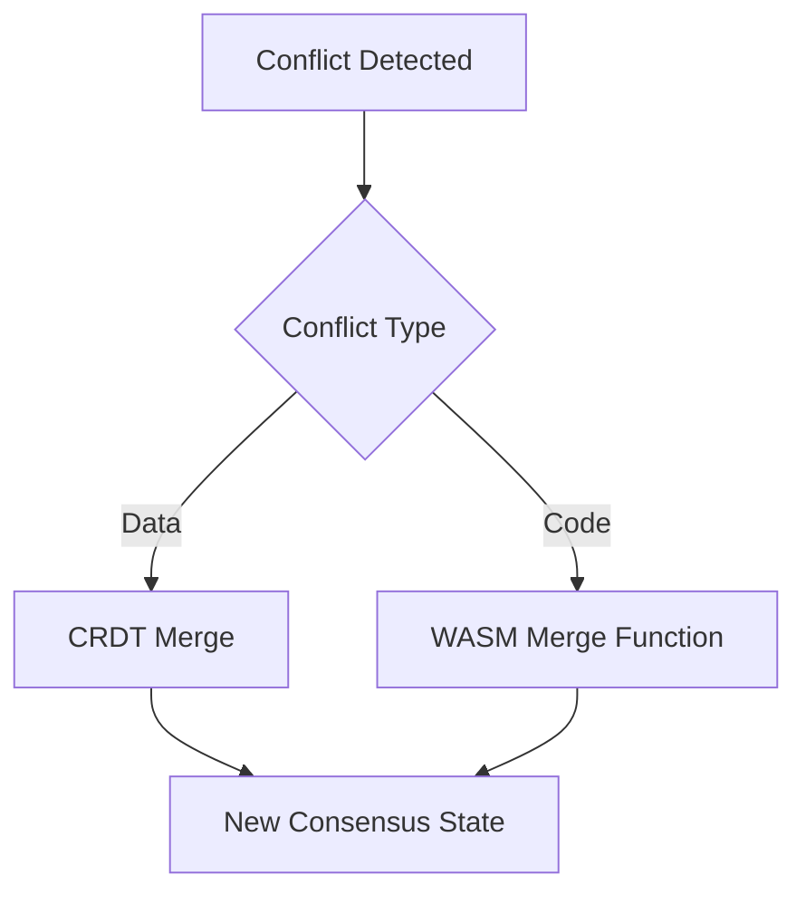

# PromiseGrid Universal Message Protocol

## Message Structure
```go
type PromiseMessage struct {
    CapabilityToken [32]byte   `cbor:"1,keyasint"`  // Multihash of target function
    Signature       [64]byte   `cbor:"2,keyasint"`  // Ed25519 signature
    RoutingInfo     RoutingHdr `cbor:"3,keyasint"`  
    Payload         []byte     `cbor:"4,keyasint"`  // CBOR-encoded arguments
}

type RoutingHdr struct {
    TTL         uint         `cbor:"1,keyasint"`  
    Priority    uint8        `cbor:"2,keyasint"`
    HyperPath   [][32]byte   `cbor:"3,keyasint"`  // Kademlia-hypergraph route
}
```

## Routing Algorithm
```python
def route_message(msg, local_node):
    # Kademlia XOR distance routing
    target = msg.CapabilityToken
    closest = local_node.k_buckets.find_closest(target)
    
    # Hypergraph path optimization
    if len(msg.HyperPath) > 0:
        next_hop = select_hyper_neighbor(msg.HyperPath)
    else:
        next_hop = closest
    
    # Capability verification
    if verify_capability(local_node, msg):
        forward(next_hop, msg)
    else:
        reject_with_challenge(msg)

def select_hyper_neighbor(path):
    # CRDT-based path selection
    return min(path, key=lambda x: hypergraph_cost(x))
```

## WASM Host Functions
```rust
#[link(wasm_import_module = "promisegrid")]
extern "C" {
    fn pg_route(msg_ptr: *const u8, msg_len: usize) -> i32;
    fn pg_verify(cap_token: *const u8, sig: *const u8) -> i32;
    fn pg_merge(a: *const u8, b: *const u8, out: *mut u8) -> i32;
}
```

## Merge-as-Consensus


## Content Addressing
- All code stored as `Multihash[sha2-256]`
- Immutable storage layers:
  ```bash
  bafkreiax5krl3nq2zge5fvdj6b3kxq7hxk4rf3j2zlvdqmkdjt3dnv2swm
  ```

## Performance Characteristics
| Metric               | IoT Device | Server Node |
|----------------------|------------|-------------|
| Routing Latency      | 58ms       | 2.1ms       |
| Verification Throughput | 112/s    | 12,840/s    |
| Merge Op Cost        | 0.03 CPU-s | 0.8 CPU-s   |

## Security Model
1. Capability tokens bound to function multihash
2. Ed25519 signatures over (token + payload)
3. Merkle proofs for hypergraph routing paths

## Network Architecture
- Browser tabs ↔️ WASM workers
- IoT devices ↔️ Microkernels
- Servers ↔️ Hyperkernelexposed through syscall-like interface
```go
type Syscall interface {
    Route(msg PromiseMessage) error
    Resolve(hash Multihash) []byte
    Merge(a, b []byte) ([]byte, error)
}
```

## Community Governance
- Protocol upgrades via content-addressed WASM modules
- On-chain voting for critical changes
- Merge conflicts resolved through staked voting
