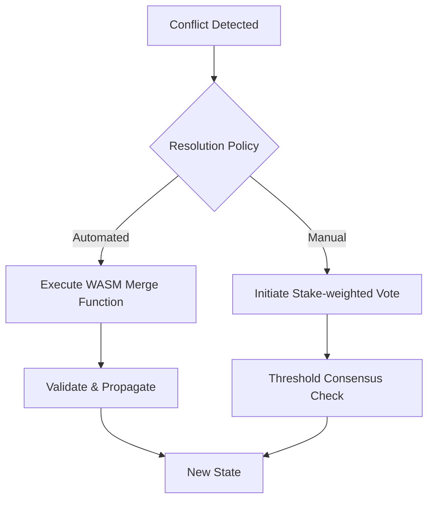

# PromiseGrid Hyperkernel Routing Protocol v3

## Core Message Structure
```go
type Message struct {
    GridHeader  GridMetadata  `cbor:"1,keyasint"`
    RoutingPath [][]byte      `cbor:"2,keyasint"`  
    Payload     []byte        `cbor:"3,keyasint"`
    Signature   byte      `cbor:"4,keyasint"`
}

type GridMetadata struct {
    ContentCID  multihash.Multihash `cbor:"1,keyasint"`
    TTL         uint32              `cbor:"2,keyasint"`
    ResourceReq ResourceSpec        `cbor:"3,keyasint"`
}

type ResourceSpec struct {
    CPUMillis  uint32 `cbor:"1,keyasint"`
    MemoryKB   uint16 `cbor:"2,keyasint"`
}
// CBOR encoding ensures compact representation[1][6]
```

## Hybrid Routing Algorithm
```
function route(msg, node):
    // Capability verification[3][12]
    if !verify_signature(msg.ContentCID, msg.Signature):
        return challenge_sender(msg)
    
    // Resource availability check[14]
    if !has_resources(msg.GridHeader.ResourceReq):
        defer_to_market(msg)
    
    // Kademlia-based CID routing[2][15]
    neighbors := kad_find_peers(msg.ContentCID)
    
    // Conflict detection and merge[4][9]
    if existing := check_cache(msg.ContentCID); existing:
        merged := pg_merge(existing, msg.Payload)
        store_cache(msg.ContentCID, merged)
        return merged
    
    // Nested message propagation[9][15]
    for nested in msg.RoutingPath:
        spawn route(nested, node)
    
    // Resource-aware forwarding[2][7]
    forward_to(select_neighbor(neighbors, msg.ResourceReq))
```

## WASM Host Interface
```rust
#[link(wasm_import_module = "pg_kernel")]
extern "C" {
    fn pg_route(msg_ptr: *const u8, msg_len: u32) -> u32;
    fn pg_verify(cid: *const u8, sig: *const u8) -> u32;
    fn pg_merge(a: *const u8, b: *const u8, out: *mut u8) -> u32;
    fn pg_cache_get(key: *const u8, buf: *mut u8) -> u32;
}
// Exposes core grid functions to WASM modules[5][14]
```

## Content Addressing & Execution
```go
func StoreComponent(code []byte) multihash.Multihash {
    hasher := multihash.SHA3_256.New()
    hasher.Write(code)
    return multihash.Encode(hasher.Sum(nil), multihash.SHA3_256)
}
// Immutable content-addressable storage[6][12]

// Cross-Platform Runtime Matrix
| Platform       | Sandbox         | Max Resources      | Launch Time |
|----------------|-----------------|--------------------|-------------|
| IoT (ESP32)    | WASM3           | 160KB RAM, 100ms   | <20ms       |
| Browser        | WebAssembly     | 50ms CPU Budget    | Instant     |
| Server         | runwasi/K8s     | 8vCPU, 32GB RAM    | 200ms       |
| Edge           | wasm-micro-runtime | 2MB RAM         | 50ms        |
```

## Security Model
```
Capability Token Structure:
+---------------------+---------------------+
| Function CID        | Ed25519 Signature   |
| (multihash)         | (over CID+Payload)  |
+---------------------+---------------------+
| Validity Window     | Resource Limits     |
| (start/end epoch)   | (CPU/Mem/Storage)   |
+---------------------+---------------------+
// Fine-grained access control[3][12][15]
```

## Merge-as-Consensus


## Governance & Resource Market
```go
type GovernanceProposal struct {
    AuthorCID   multihash.Multihash
    SpecCID     multihash.Multihash
    Votes       map[multihash]uint64 // Staked tokens
}

type ResourceOffer struct {
    ProviderCID multihash.Multihash
    Resources   ResourceSpec
    Price       uint64 // Microcredits
    Expiry      int64
}
// Decentralized resource allocation[12][16]
```

## Kernel Requirements
```c
// Minimal IoT Kernel API
void pg_route_message(struct message* msg);
int pg_verify_capability(const uint8_t* token);
void pg_cache_update(const uint8_t* cid, const void* data);
// Fits in <8KB ROM footprint[11][14]
```

## Protocol Extensibility
```go
type HyperMessage struct {
    BaseCID     multihash.Multihash
    Extensions  []Message
}
// Nested messages enable protocol evolution[9][15]
