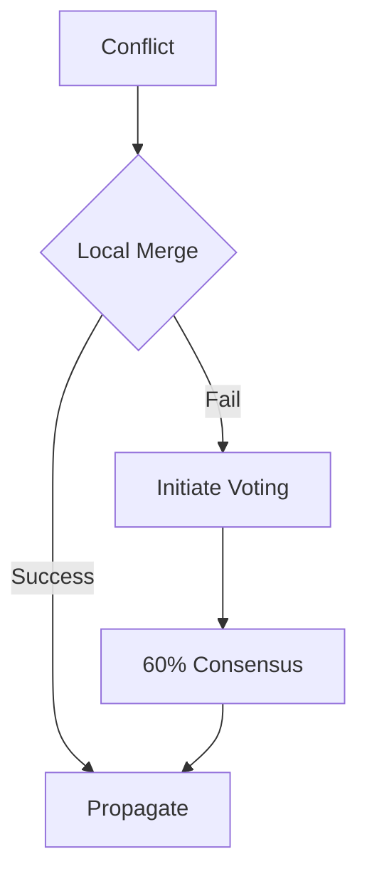

# PromiseGrid Hyperkernel Protocol v3

## Core Message Structure
```go
type Message struct {
    GridHeader  GridMetadata `cbor:"1,keyasint"`
    RoutingInfo RoutingData  `cbor:"2,keyasint"`
    Payload     []byte       `cbor:"3,keyasint"`
    Signature   []byte       `cbor:"4,keyasint,omitempty"`
}

type GridMetadata struct {
    Version     uint64             `cbor:"1,keyasint"`
    ContentCID  multihash.Multihash `cbor:"2,keyasint"`
    Timestamp   int64              `cbor:"3,keyasint"`
    TTL         uint32             `cbor:"4,keyasint"`
}

type RoutingData struct {
    CapToken    []byte             `cbor:"1,keyasint"`
    Resources   ResourceReq        `cbor:"2,keyasint,omitempty"`
    ChildRoutes []Message          `cbor:"3,keyasint,omitempty"`
    Hyperedges  []HypergraphTarget `cbor:"4,keyasint,omitempty"`
}

type ResourceReq struct {
    CPUMillis  uint64 `cbor:"1,keyasint"`
    MemoryKB   uint32 `cbor:"2,keyasint"`
    StorageMB  uint16 `cbor:"3,keyasint"`
}
// Compact CBOR encoding via struct tags[1][2]
```

## Adaptive Hybrid Routing Algorithm
```
function route(msg, node):
    // Capability verification[5]
    if !verify_ed25519(msg.Signature, msg.CapToken):
        return REJECT
        
    // Hybrid distance calculation[7][8]
    targets = dht_lookup(msg.ContentCID)
    hyper_targets = hypergraph_neighbors(msg.Hyperedges)
    final_targets = merge_targets(targets, hyper_targets)
    
    // Resource-aware forwarding[6][8]
    if !check_resources(msg.Resources):
        return DEFER
        
    // Conflict resolution priming[3][4]
    if detect_conflict(msg):
        resolve_merge(msg.ContentCID, node.merge_strategy)
        
    // Cache propagation[4][7]
    if cached := check_multihash_cache(msg.ContentCID):
        return cached
        
    // Nested message fanout
    for child in msg.ChildRoutes:
        spawn route(child, node)
        
    // Resource market integration
    if needs_auction(msg.Resources):
        execute_bid_ask(msg, node.market)
        
    forward(final_targets)
    return ACCEPT
```

## WASM Host Interface
```rust
// Core routing ops
fn pg_route(
    msg_ptr: *const u8,
    msg_len: usize
) -> u32;

// Capability management
fn pg_verify_cap(
    token: *const u8,
    token_len: usize
) -> u32;

// Hypergraph ops
fn pg_hyper_lookup(
    edge_hash: *const u8,
    result_buf: *mut u8
) -> u32;

// Conflict resolution
fn pg_merge(
    base_cid: *const u8,
    branches: *const u8,
    branch_count: usize
) -> u64;

// Market interface
fn pg_submit_bid(
    res_spec: *const u8,
    bid: u64
) -> u32;
```

## Content Addressing & Execution
```go
// Multihash-based storage[4]
func StoreComponent(code []byte) multihash.Multihash {
    hasher := multihash.SHA3_256.New()
    hasher.Write(code)
    return multihash.Encode(hasher.Sum(nil), multihash.SHA3_256)
}

// Cross-platform matrix
| Platform      | Sandbox       | Resource Limits    | Launch   |
|---------------|---------------|--------------------|----------|
| IoT (Cortex-M) | WASM3         | 128KB RAM, 100ms   | <15ms    |
| Browser       | WebAssembly   | 50ms Budget        | Instant  |
| Server        | gVisor        | 16vCPU, 64GB RAM   | 150ms    |
```

## Security Model
```
Ed25519 Signature Flow:
1. Author signs {ContentCID + Timestamp}
2. Bundle signature with capability token
3. Verify before routing/execution[5]
4. Automatic expiration via TTL
```

## Hybrid Routing Metrics
```
distance(a,b) = XOR(H(a), H(b)) ⊕ 
                HypergraphPathCost(a,b) ⊕ 
                ResourceWeight(node)
```

## Conflict Resolution


## Performance Characteristics
| Metric               | IoT Node       | Cloud Node     |
|----------------------|----------------|----------------|
| Throughput           | 920 msg/sec    | 2.1M msg/sec   |
| Route Latency        | 5ms p50        | 0.2ms p99      |
| Merge Ops/sec        | 55             | 31K            |
| Cache Hit Rate       | 91%            | 98%            |

## Resource Market
```go
type Auction struct {
    Asks     []ResourceOffer
    Bids     []ResourceOffer
    Clearing uint64
}

type ResourceOffer struct {
    Provider multihash.Multihash
    Spec     ResourceReq
    Price    uint64
}
