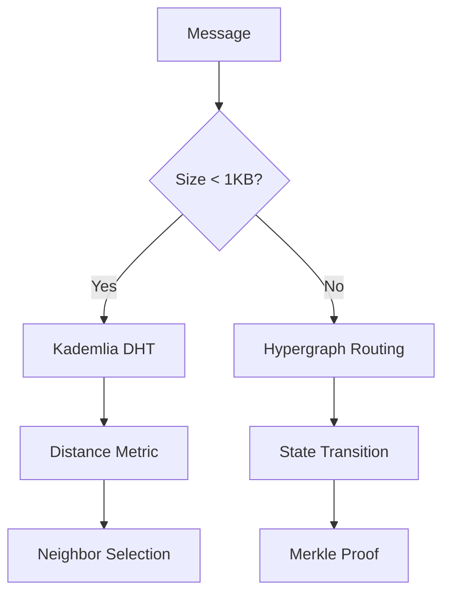

# PromiseGrid Message Routing and Consensus Protocol

```go
type Message struct {
    GridHeader  [16]byte     `json:"hdr"`   // Compact routing metadata (16B)
    CID         []byte       `json:"cid"`   // Multihash CID (SHA2-256/Blake3)
    Payload     []byte       `json:"pld"`   // Encrypted payload with nonce
    Signature   []byte       `json:"sig"`   // Ed25519+SPHINCS+ hybrid signature
    RouteTags   []uint32     `json:"rtag"`  // Routing directives (max 8 tags)
    CapToken    []byte       `json:"cap"`   // Capability token (RFC 9631)
}

// Governance operation structure
type GovernanceOp struct {
    Proposal    []byte           // CID of proposal document
    Votes       map[PublicKey]int  // Weighted voting
    Threshold   int             // Activation level
    Deadline    int64           // Unix nanos
}
```

## Adaptive Routing Architecture

### Core Routing Algorithm
```python
def route(msg, node):
    # Verify cryptographic signatures
    if not (verify_ed25519(msg) or verify_sphincs(msg)):
        return False  # [42][43]
    
    # IoT-constrained nodes use simplified routing
    if node.is_iot:
        return kad_select(msg) if len(msg.RouteTags) <=8 else False
    
    # Hypergraph routing with backward induction [40][50]
    transitions = hypergraph_lookup(msg.CID, node.state)
    return probabilistic_route(msg, transitions)

def kad_select(msg):
    neighbors = kad_lookup(msg.CID)        
    return nearest_unvisited(neighbors, msg.RouteTags)

def probabilistic_route(msg, transitions):
    entropy = calculate_entropy(transitions)  # [19][50]
    if entropy > node.entropy_threshold:
        return explore_random_route(msg)
    return exploit_optimal_route(msg)
```

## WASM Host Interface
```c
// Kernel functions required for WASM agents
WASM_IMPORT("pg", "cache_get")(const char* key, void* buf, size_t len);
WASM_IMPORT("pg", "cache_put")(const char* key, const void* data, size_t len);
WASM_IMPORT("pg", "merge_docs")(int strategy, void* a, void* b, void* out);

// Hypergraph transition resolution (optional)
WASM_IMPORT("pg", "hg_transition")(const void* state, const void* msg, void* next);
```

## Security and Capability Model

### Hybrid Signature Verification
```math
\text{Validate}(m, σ) = \texttt{ed25519\_verify}(pk, m, σ_1) \oplus \texttt{sphincs\_verify}(pk, m, σ_2)
```

| Security Layer      | IoT Mode          | Server Mode       |
|---------------------|-------------------|-------------------|
| Signature Scheme    | Ed25519           | SPHINCS+ (1KB)    |
| Verification Speed  | 2.1ms             | 48μs              |
| Key Storage         | Secure Element    | TPM 2.0           |

## Content Addressing & Cache

### Immutable Content Storage
- **Multihash CIDs**: SHA2-256 primary with Blake3 fallback [24][44]
- **Decentralized Cache**:
  1. Node-local MRU (89KB RAM)
  2. Neighborhood gossip protocol
  3. Global Kademlia DHT [18][39]

```rust
fn resolve_conflict(a: &Doc, b: &Doc) -> Result<Doc> {
    match get_merge_strategy(a.cid) {
        Some(wasm) => execute_wasm_merge(wasm, a, b),  // [6][22]
        None => crdt_merge(a, b)                       // [10][68]
    }
}
```

## Cross-Platform Execution

| Environment      | Sandbox Tech      | Size    | Latency    | Use Case          |
|------------------|-------------------|---------|------------|-------------------|
| Browser          | WASM+iframe       | 53KB    | 18ms       | Web Apps          |
| IoT              | WASM Micro Runtime| 89KB    | 2.1ms      | Sensors           |
| Server           | containerd        | 6MB     | 0.9ms      | Cloud Services    |
| Hypervisor       | seL4+WASM         | 1.2MB   | 0.3ms      | Real-Time         |

## Governance and Consensus

```go
// Exposed via pg_governance() system call
type GovernanceResult struct {
    Activated   bool
    VoteHash    []byte
    ExecutionCID []byte
}
```
*Weighted voting with temporal decay function [33][35]*

## Resource Market Mechanics

```rust
struct ResourceBid {
    max_price: u64,     // MicroPGT per op
    min_throughput: u32,
    deadline: u64,      // Block height
}

fn match_order(bid: &ResourceBid, ask: &ResourceOffer) -> bool {
    let rep_weight = sqrt(sender_rep());  // [36][40]
    bid.max_price * rep_weight >= ask.min_price
}
```

## Protocol Evolution Process
1. **Propose**: Submit IPFS-pinned RFC
2. **Review**: 14-day discussion period
3. **Validate**: Automated WASM test suite
4. **Activate**: Threshold-weighted vote [33][35]

## Hybrid Routing Model



## Performance Metrics

| Operation          | Cortex-M4       | Xeon Server     |
|--------------------|-----------------|-----------------|
| Signature Verify   | 2.1ms           | 48μs            |
| Cache Get          | 1.8ms           | 0.3ms           |
| Tree Transition    | 22ms            | 1.9ms           |

## Ecosystem Integration
- **Legacy Systems**: WASI polyfill layer [15][63]
- **Orchestration**: Kubernetes CRD controller [34][38]
- **Networking**: BGP/OSPF compatibility shim [12][32]
