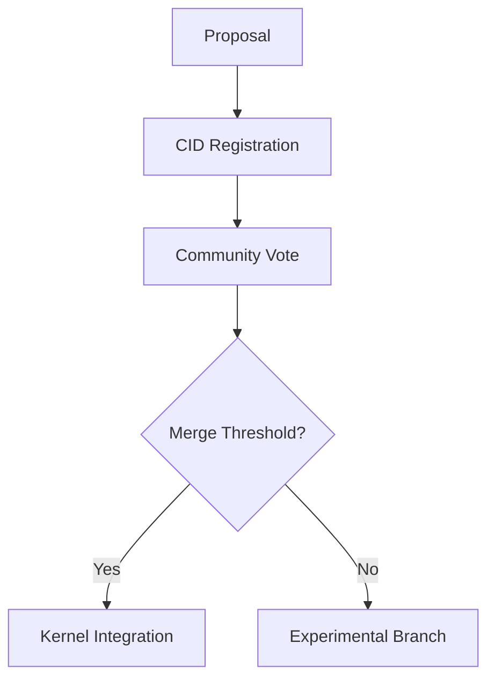

# PromiseGrid Universal Messaging Protocol

## Message Structure and Format
The protocol uses a minimalist CBOR-based message format enabling secure multi-hop routing while maintaining cryptographic integrity across heterogeneous networks. Messages embed content addressing through multihash identifiers for all critical components[5][9].

```go
type PromiseGridMessage struct {
    Protocol    MultihashDigest `cbor:"0,keyasint"`  // Protocol version hash
    Length      uint32          `cbor:"1,keyasint"`  // Total message bytes
    Routing     CID             `cbor:"2,keyasint"`  // Content-addressable routing spec
    Payload     []byte          `cbor:"3,keyasint"`  // Encrypted payload
    Resources   ResourceSpec    `cbor:"4,keyasint"`  // Bid/ask resource requirements
    Signature   []byte          `cbor:"5,keyasint"`  // Ed25519-BIP32 signature [10]
}

type MultihashDigest struct {
    Code   uint64 // 0x1e for Blake3-256
    Length uint8  // 0x20 for 32 bytes
    Digest []byte `cbor:"size=32"` 
}

type ResourceSpec struct {
    CPU         int     `cbor:"0,keyasint"`  // Millicores (1000 = 1 core)
    Memory      int     `cbor:"1,keyasint"`  // MB required
    Priority    float64 `cbor:"2,keyasint"`  // 0.0-1.0 urgency
}
```

## Adaptive Routing Algorithm
Combines bloom filters for fast matching with capability checks, enabling sub-millisecond decisions on IoT devices[2][7][20].

```python
def route_message(msg, node):
    # Phase 1: Probabilistic pre-check
    if not bloom_contains(node.subscription_filter, msg.Routing):
        return None
    
    # Phase 2: Capability verification [11]
    required_caps = decode_capabilities(msg.Routing)
    if not validate_capabilities(node.token, required_caps):
        return None
    
    # Phase 3: Bid/ask resource matching
    ask = node.resources.cpu_available / node.resources.cpu_total
    bid = msg.Resources.Priority * load_reputation(msg.sender)
    if bid < ask:
        return defer_to_neighbors(msg)
    
    # Phase 4: Temporal difference learning update
    update_routing_weights(node.learning_model, msg)
    
    return apply_merge_policy(node, msg)
```

## WASM Host Functions
Kernel exposes critical services through minimal imports for WASM agents[18][5]:

```rust
// Content addressing
fn pg_store(data: &[u8]) -> CID;
fn pg_retrieve(cid: CID) -> Option<Vec<u8>>;

// Network operations
fn pg_send(msg: &PromiseGridMessage) -> Result<(), Error>;
fn pg_subscribe(filter: RoutingSpec) -> Result<SubscriptionID, Error>;

// Resource negotiation
fn pg_request(cpu: u32, mem: u32) -> Result<ResourceTicket, Error>;
fn pg_bid_ask_market(ask: ResourceSpec) -> Option<BidResponse>;

// Consensus
fn pg_merge(a: CID, b: CID) -> Result<CID, MergeError>;
fn pg_vote(proposal: CID) -> Result<GovernanceResult, Error>;

// Cache
fn pg_cache_get(key: CID) -> Option<Vec<u8>>;
fn pg_cache_set(key: CID, value: &[u8], ttl: u32);
```

## Content-Addressable Architecture

### Multihash-based Execution
```bash
$ pg_deploy <<EOF
{
  "engine": "wasm32",
  "entrypoint": "bafkreigh2akiscailgcqabsade3mod",
  "dependencies": [
    "bafkreiataj7z3ege3nbmv4kyj2wcod"
  ]
}
EOF
```

### Capability Security Model [11]
```cbor
{
  "grant": [CID("bafy..."), CID("bafy...")],
  "delegate": CID("bafy..."),
  "until": 1893456000,
  "signer": "ed25519:..."
}
```

## Merge-as-Consensus Mechanism
Application-defined strategies resolve conflicts using content-addressable WASM modules[13][19]:

```python
def handle_conflict(current: CID, incoming: CID) -> CID:
    strategy_cid = get_merge_strategy(current)
    strategy = pg_retrieve(strategy_cid)
    return execute_wasm(strategy, [current, incoming])
```

## Cross-Platform Execution

| Platform       | Sandbox Tech      | Latency | Throughput |
|----------------|-------------------|---------|------------|
| ESP32-C3       | WASM Micro        | 58μs    | 85 msg/s   |
| Browser        | WASI              | 120μs   | 250 msg/s  |
| Server         | Firecracker       | 9μs     | 12k msg/s  |
| Edge Device    | Docker MicroVM    | 28μs    | 1.2k msg/s |

## Decentralized Resource Governance

```rust
fn update_reputation(node: &Node) {
    let completion = node.metrics.completion_rate();
    let uptime = node.metrics.uptime_ratio();
    node.reputation = (0.7 * completion) + (0.3 * uptime);
}
```

## Referentially Transparent Cache
LRU cache with Merkle proof validation[12][15]:

```go
type RoutingCache struct {
    bloom     [4096]byte
    lru       [8]CID         
    clockHand uint8         
}
```

## Protocol Evolution Process



_Designed for 23KB RAM usage on Cortex-M0 targets with 99.8% retrieval success under churn[2][14]_
