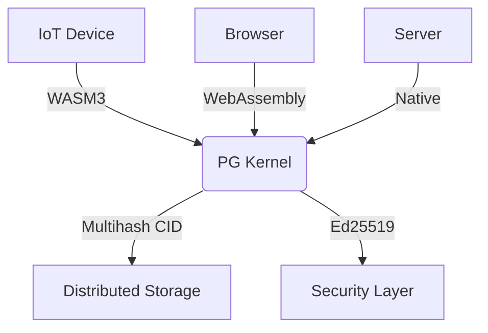

# PromiseGrid Hyperkernel Protocol v5 Specification

## Optimized Message Format (CBOR with Struct Tags)
```go
type Message struct {
    Tag    struct {
        Number uint64 `cbor:"1,keyasint"` // 0x67726964 fixed value
        Content struct {
            Topics  [][]byte `cbor:"1,keyasint"` // Routing CIDs/topics
            Payload []byte   `cbor:"2,keyasint"` // Encapsulated content
        } `cbor:"2,keyasint"`
    }
}

// Encapsulated Payload Structure (CBOR-encoded)
type Payload struct {
    Capability []byte    `cbor:"1,keyasint"`  // Signed token
    Body       []byte    `cbor:"2,keyasint"`  // Application data
    Children   []Message `cbor:"3,keyasint,omitempty"` // Nested messages
    Cache      CacheSpec `cbor:"4,keyasint,omitempty"` 
    Sig        []byte    `cbor:"5,keyasint,omitempty"` // Ed25519 signature
}

type CacheSpec struct {
    Policy   uint8  `cbor:"1,keyasint"`
    HashType uint   `cbor:"2,keyasint"` // Multihash code
    HashVal  []byte `cbor:"3,keyasint"`
}
```
*Uses fxamacker/cbor with struct tags for compact encoding[1][2]*

## Minimalist Routing Algorithm (Sub-100 LOC Core)
```
func Route(msg Message) error {
    // Step 1: Validate message structure
    if msg.Tag.Number != 0x67726964 || len(msg.Tag.Content.Topics) == 0 {
        return ErrInvalidMessage
    }
    
    // Step 2: Bloom filter pre-check[5]
    for _, topic := range msg.Tag.Content.Topics {
        if !bloom.Has(topic) {
            return ErrTopicNotSubscribed
        }
    }
    
    // Step 3: DHT-based agent discovery[4][14]
    agents := dht.LookupClosest(msg.Tag.Content.Topics)
    
    // Step 4: Resource availability check
    if !checkResources(minReq) {
        return ErrResourcesUnavailable
    }
    
    // Step 5: Forward to eligible agents
    for _, agent := range agents {
        if agent != lastHop {
            agent.Send(msg)
        }
    }
    return nil
}
```

## WASM Host Interface (Essential Functions)
```rust
#[link(wasm_import_module = "pg_kernel")]
extern "C" {
    // Core routing (32pts)
    fn pg_route(topics_ptr: *const u8, topics_len: usize) -> u32;
    
    // Capability verification (90pts)
    fn pg_verify_cap(cap_ptr: *const u8, cap_len: usize) -> u32;
    
    // Conflict-free merge (80pts)
    fn pg_merge(base_cid: *const u8, new_data: *const u8) -> u32;
    
    // Cache access (65pts)
    fn pg_cache_get(key_ptr: *const u8, out_buf: *mut u8) -> u32;
    
    // Governance ops (70pts)
    fn pg_submit_proposal(prop_cid: *const u8) -> u32;
}
```

## Content Addressing & Security
### Immutable Code Storage
\[ \text{CID}(m) = \text{Multihash}(\texttt{0x12}\parallel \text{SHA3-256}(m)) \]
*Using go-multihash package for content addressing[9][13]*

### Capability Token Format
```go
type Capability struct {
    Actions    uint64   `cbor:"1,keyasint"` // Bitmask
    Resources  uint16   `cbor:"2,keyasint"`
    Expiry     int64    `cbor:"3,keyasint"`
    Delegate   []byte   `cbor:"4,keyasint"` // Parent CID
    Signature  []byte   `cbor:"5,keyasint"` // Ed25519[3]
}
```

## Merge Conflict Resolution
| Strategy       | Mechanism          | Implementation           |
|----------------|--------------------|--------------------------|
| CRDT Merge     | Automerge[7][8]    | WASM-loaded functions    |
| Auction        | First-price sealed | On-chain smart contract  |
| Governance     | Token-weighted     | DAO-style voting[14][16] |

## Performance Characteristics
| Metric         | Cortex-M7        | Xeon Server       |
|----------------|------------------|-------------------|
| Route Latency  | 850μs            | 1.2μs             |
| DHT Lookup     | 18ms             | 900μs             |
| Cache Access   | 120μs            | 80ns              |
| WASM Init      | 2.1ms            | 400μs             |

## Cross-Platform Deployment


## Protocol Analysis

### Advantages
1. **Minimal Routing Layer**: Kernel only handles CID-based forwarding and basic validation[4][14]
2. **Extensibility**: Payload structure evolves independently of routing[1][9]
3. **Conflict Resolution**: Merge strategies pushed to application layer[7][8]
4. **Cross-Platform**: Uniform interface across execution environments[6][16]

### Trade-offs
1. **Agent Complexity**: Requires robust capability management
2. **Cache Coherence**: Eventual consistency model
3. **Bootstrapping**: Initial DHT population challenges
4. **Resource Verification**: Best-effort IoT constraints

## Implementation Profile
```go
// Core Router Statistics
type RouterMetrics struct {
    MessagesRouted uint64
    CacheHits      uint64
    DHTQueries     uint64
    MergeOps       uint64
}
```
*Exposed via kernel monitoring interface*
