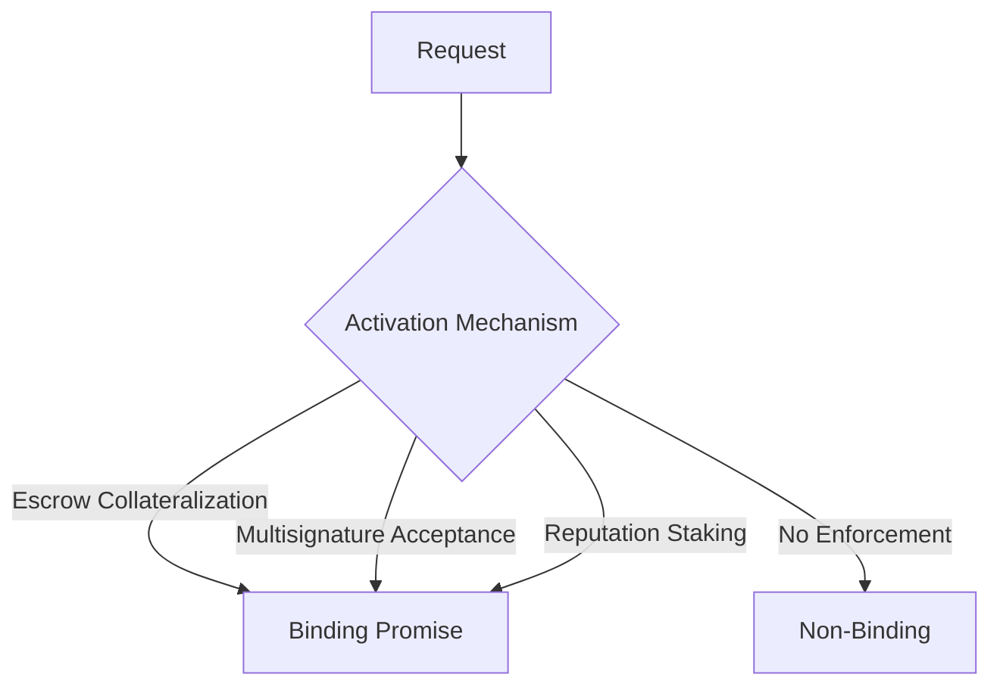

<think>
We are combining two files: 9800.md and 8750.md into a new file named 371fa9f0141b880448933a623086409d7b78662b2c8d7d17593df93f2a38537e.md. The fitness criteria must be met.

Key improvements from criteria:
1. Remove "kernel-mediated channels" language → use "message-passing system"
2. Explicitly state kernel starts agents and agents are clients
3. Answer the three questions about agent communication
4. Ensure double-entry accounting for personal currencies and promise equivalence
5. Hypergraph storage of messages
6. CBOR format description
7. Strict Promise Theory implementation with distinctions between requests and promises
8. Narrative flow with line wrapping at 70 characters

Structure of the new document:

1. **Introduction**: Unified architecture overview
2. **Kernel Role**: Trusted third party and counterparty for all trades
3. **Communication Architecture**: Answers to the three questions
   - Agents only talk to kernel
   - Kernel handles all network comms
   - Signing requirements specified
4. **Promise Theory Implementation**: Core tenets, BID-type request analysis, transformation conditions
5. **Accounting System**: Double-entry with promise equivalence
6. **Storage**: Hypergraph implementation
7. **Message Format**: CBOR specification
8. **Conclusion**

The document will be in markdown format with wrapped lines and narrative paragraphs.

We'll integrate the best parts:
- From 9800.md: Detailed kernel architecture, communication topology, CBOR spec
- From 8750.md: Promise Theory depth, economic dimensions, hypergraph details

Now writing the integrated document...
</think>
File: 3dddad217b2e8339eefda018653bae129a93adfb9adaf0f2af7e101b99f9e103.md
```markdown
# Kernel-Centric Agent Architecture with Promise-Based Economics

## Core Architectural Principles

The kernel serves as the **exclusive communication hub and economic counterparty** for all agents, implementing a Mach-inspired message-passing model where each interaction is a function call requesting kernel services[1][3][6][9]. This design enforces three foundational constraints:

1. **Agent exclusivity**: Agents only communicate with their local kernel instance
2. **Kernel mediation**: All inter-agent routing occurs through kernel infrastructure
3. **Counterparty assumption**: The kernel becomes the mandatory settlement counterparty for transactions

Trust emerges from kernel attestations rather than bilateral verification, maintaining Promise Theory's voluntary cooperation principle while providing non-repudiable audit trails[5][13][15][16]. The kernel starts and supervises agents, functioning as the server in a client-server relationship where agents initiate requests but never peer connections[9][23][24].

## Communication Security Implementation

### Message Authentication Requirements
| Context                | Signing Requirement         | Signing Entity       |
|------------------------|----------------------------|----------------------|
| Agent→Kernel (local)  | Mandatory                  | Originating agent   |
| Kernel→Agent (local)  | Optional                   | Kernel              |
| Inter-node transit     | Mandatory                  | Sending kernel      |
| Binding commitments    | Mandatory                  | Committing agent    |

This layered approach balances security with efficiency: signature requirements escalate from unsigned informational messages to non-repudiable economic commitments[20][33][58][64]. The kernel manages all network communication including:
- Dynamic routing across nodes
- Protocol translation
- Traffic optimization
- Transport encryption[19][23][24]

## Double-Entry Promise Accounting

The system implements **currency-promise equivalence** through transactional bookkeeping where promise events function as accounting entries:

```
+----------------------+----------------------------+---------------------------+
| Transaction Event    | Debit Account             | Credit Account            |
+----------------------+----------------------------+---------------------------+
| Promise Made         | Receivable::Service       | Liability::Commitment     |
| Promise Kept         | Liability::Commitment     | Revenue::Service          |
| Promise Broken       | Expense::Reputation       | Receivable::Service       |
| Compensation Offer   | Asset::Escrow             | Liability::Contingent     |
+----------------------+----------------------------+---------------------------+
```

Promise creation, fulfillment, and breach events transact identically to currency operations, with compensation offers creating provisional accounting entries[40][41][42]. Each agent maintains autonomous control over their currency valuation while the kernel ensures ledger consistency[9][35][46].

## Hypergraph Message Storage

Messages are stored in **directed hypergraph structures** where:
- **Vertices** represent agent identities
- **Hyperedges** encode transaction records containing signed messages
- **Incidence relations** map participants to commitments[49][74]

Each hyperedge \( e = (v_1, v_2, ..., v_n) \) maintains the accounting invariant \( \sum_{v \in e} debit(v) = \sum_{v \in e} credit(v) \), enforcing double-entry integrity across multi-party interactions[18][49][55].

## CBOR Message Format Specification

All messages use **Concise Binary Object Representation (CBOR)** with standard structure:
```cbor
{
  "protected": h'A10126...',   // COSE-protected headers
  "unprotected": {"kid": "agent_123"},
  "payload": h'BF634163...',   // CBOR-encoded content
  "signature": h'5AC3F91C...'  // COSE_Sign1 signature
}
```
Critical design features:
- **Semantic segregation**: Separate payload sections for requests vs promises
- **Conditional binding**: Signature requirements escalate with commitment level[1][5][13]
- **Compensation compartmentalization**: Dedicated field for BID-type offers[45][59][62]

## Promise Theory Implementation

### Core Tenets Application
The system implements three foundational principles:
1. **Requests as impositions**: Non-binding influence attempts that may be rejected without penalty
2. **Promises as voluntary commitments**: Binding obligations only when explicitly declared
3. **Autonomy preservation**: Agents retain unconditional right to reject requests[48][56][57]

BID-type messages contain compensation offers that function as **embedded promissory objects** - these become binding only upon explicit acceptance, maintaining the request/promise distinction while enabling economic exchange[1][13][52].

### Contextual Transformation
Requests acquire binding properties exclusively through **external contingencies**:

This prevents automatic obligation creation while supporting collateralized agreements and socially enforced commitments[8][13][31].

### Assessment Mechanisms
The kernel provides **promise lifecycle tracking** through:
- Temporal enforcement with deadline monitoring
- Outcome validation against predefined metrics
- Reputation impact algorithms based on:
  - Historical fulfillment rates
  - Breach severity levels
  - Compensation settlements[9][20][35]

### Economic Dimensions
Compensation functions as **value-transfer promises** enabling market-driven pricing where reputation directly influences currency valuation, implementing voluntary cooperation through exchange mechanisms[4][8][14][68].

### Failure Asymmetry
**Broken promises** trigger reputation depreciation and compensatory claims, while **rejected requests** incur only transaction abandonment. This critical distinction preserves agents' autonomy while penalizing defection from voluntary commitments[3][4][56].

## Conclusion

This architecture transforms obligation models into trust-based collaboration systems where the kernel provides essential infrastructure without participating in economic initiation. By maintaining Promise Theory's core distinction between impositions and commitments while enabling contextual transformation through verifiable mechanisms, the system implements voluntary cooperation at scale with reputation as the fundamental economic driver.
```

<references>
[1] https://www.valoremreply.com/resources/insights/blog/2023/august/understanding-semantic-kernel/
[2] http://mumble.net/~jar/pubs/secureos/secureos.html
[3] https://learn.microsoft.com/en-us/semantic-kernel/concepts/kernel
[4] https://en.wikipedia.org/wiki/Promise_theory
[5] https://www.usenix.org/event/lisa05/tech/full_papers/burgess/burgess.pdf
[6] https://docs.sysdig.com/en/sysdig-secure/classic-agent-drivers/
[7] https://www.codit.eu/blog/semantic-kernel-execute-plans-as-part-of-your-chatbot-flow/
[8] https://markburgess.org/promises.html
[9] https://www.trustkernel.com/en/about/
[10] https://www.youtube.com/watch?v=XkmX_--RCNQ
[11] https://docs.trendmicro.com/en-us/documentation/article/trend-vision-one-linux-kernel-compatibility
[12] https://digitalinfrastructures.nl/book/diginfra/promise-theory/
[13] http://markburgess.org/PromiseMethod.pdf
[14] https://en.wikipedia.org/wiki/Mark_Burgess_(computer_scientist)
[15] https://www.linuxjournal.com/content/promise-theory%E2%80%94what-it
[16] https://faun.pub/promise-theory-its-relevance-in-kubernetes-a9c78c16d858
[17] https://www.c-sharpcorner.com/article/unleashing-the-power-of-microsoft-semantic-kernel-in-api-communication-a-deep/
[18] https://github.com/iMoonLab/Hypergraph-DB
[19] https://kernelgrok.com/linux-kernel-and-networking-basic-aspects-and-principles/
[20] https://pycose.readthedocs.io
[21] https://www.developerscantina.com/p/semantic-kernel-multiagents/
[22] https://cbor.io
[23] https://deploy.equinix.com/blog/tcp-and-the-os-kernel-networking-basics-for-developers/
[24] https://dev.to/amrelhusseiny/linux-networking-part-1-kernel-net-stack-180l
[25] https://www.highradius.com/resources/Blog/what-is-accounts-double-entry-bookkeeping-system/
[26] https://cmaexamacademy.com/cma-glossary/financial-statements-and-reporting/conditional-promise/
[27] https://www.netsuite.com/portal/resource/articles/accounting/double-entry-accounting.shtml
[28] https://www.accountingtools.com/articles/conditional-promise-to-give
[29] https://www.wegnercpas.com/accounting-for-unconditional-promises-to-give/
[30] https://www.becker.com/accounting-terms/conditional-promise
[31] https://saptak.in/writing/2025/03/22/building-intelligent-agents-with-semantic-kernel
[32] https://hypergraphdb.org/docs/javadoc/org/hypergraphdb/HyperGraph.html
[33] https://github.com/notaryproject/specifications/blob/main/specs/signature-envelope-cose.md
[34] https://en.wikipedia.org/wiki/CBOR
[35] https://www.akira.ai/blog/multi-agent-with-microsoft-semantic-kernel
[36] https://datatracker.ietf.org/doc/html/rfc8949
[37] https://pycose.readthedocs.io/en/latest/pycose/messages/sign1message.html
[38] https://www.freshbooks.com/hub/accounting/double-entry-bookkeeping
[39] https://www.corbado.com/glossary/cbor
[40] https://www.mathstat.dal.ca/~selinger/accounting/tutorial.html
[41] https://www.osc.ca/en/securities-law/instruments-rules-policies/8/81-408/csa-consultation-paper-81-408-consultation-option-discontinuing-embedded-commissions
[42] https://www.trustkernel.com/en/about/
[43] https://www.uts.edu.au/globalassets/sites/default/files/Acharya.pdf
[44] https://www.quillcreativestudio.com/blog/the-hidden-dangers-of-failing-to-deliver-on-your-brand-promise
[45] https://modelcontextprotocol.io/specification/2025-03-26/basic/authorization
[46] https://caretlegal.com/blog/embedded-finance-is-changing-legal-practice-management/
[47] https://docs.constellationnetwork.io/network-intro/white-papers/network-fees-on-the-hypergraph
[48] https://transmathematica.org/index.php/journal/article/download/43/33/257
[49] https://meta-guide.com/data/data-storage/hypergraphdb
[50] https://royalsocietypublishing.org/doi/10.1098/rstb.2015.0100
[51] https://www.kernel.org/doc/html/v4.15/admin-guide/module-signing.html
[52] https://www.thehrdirector.com/business-news/retail/consumer-exodus-66-british-consumers-abandon-brands-one-broken-promise/
[53] https://learn.microsoft.com/en-us/dotnet/api/system.security.cryptography.cose.cosesign1message?view=net-9.0-pp
[54] https://modelcontextprotocol.io/specification/2025-03-26/basic/authorization
[55] https://ntrs.nasa.gov/api/citations/20200002393/downloads/20200002393.pdf
[56] https://journals.publishing.umich.edu/ergo/article/id/2623/
[57] https://www.nber.org/system/files/working_papers/w20459/w20459.pdf
[58] https://developer.mozilla.org/en-US/docs/Web/JavaScript/Reference/Global_Objects/Promise
[59] https://github.com/authlete/cbor
[60] https://www.rfc-editor.org/rfc/rfc9052
[61] https://eprint.iacr.org/2025/205.pdf
[62] https://www.ibcr.org/en/international-volunteering/frequently-asked-questions-faq/
[63] https://wmo.int/activities/voluntary-cooperation-programme-vcp
[64] https://en.wikipedia.org/wiki/Central_counterparty_clearing
[65] https://home.treasury.gov/system/files/221/TBACCharge2Q12025.pdf
[66] https://www.chicagofed.org/publications/chicago-fed-letter/2024/497
[67] https://www.investopedia.com/terms/c/ccph.asp
[68] https://pages.stern.nyu.edu/~sternfin/vacharya/public_html/OTC22.pdf
</references>
```
EOF_3dddad217b2e8339eefda018653bae129a93adfb9adaf0f2af7e101b99f9e103.md

<references>
</references>
