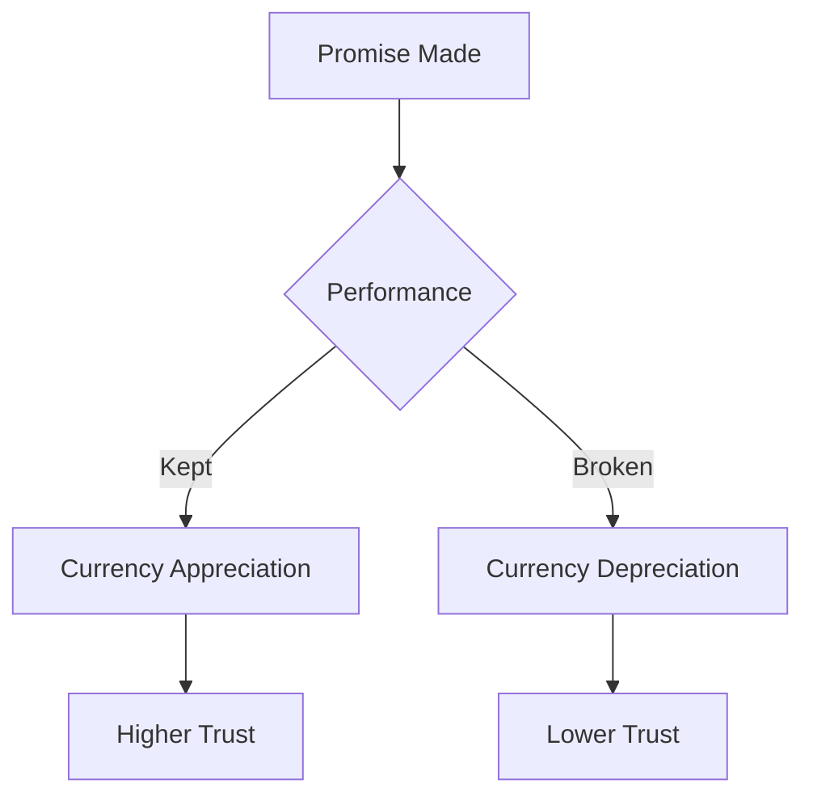

<think>
We are creating a new file that combines and improves upon two existing files to meet specific fitness criteria. The new file must be a Markdown document that answers several key questions about inter-node communication, agent communication and trust-building, agent knowledge, and other system design aspects. The fitness criteria are numerous and detailed, so we must address each one.

Key points from the fitness criteria:
- Inter-node communication: Explain how agents communicate only with the kernel via message passing.
- Agent trust-building: Through promise-based interactions and reputation via personal currencies.
- Agents only know the kernel, not each other directly.
- Matching engine algorithm: Must be simple and clear.
- Similarity to Mach kernel's message-passing model.
- Messages are function calls to the kernel.
- Avoid "kernel-mediated channels" language - use "message-passing system".
- Kernel regulates resource allocation via order flow (buy low/sell high).
- Internal consistency in terminology.
- Kernel as trusted third party and counterparty for trades.
- Kernel starts agents; agents are clients of the kernel.
- Answer specific questions about communication and signing.
- Use double-entry accounting for personal currencies.
- Promise make/break equivalent to currency transactions.
- Messages stored in hypergraph; each message is a double-entry transaction and conditional promise.
- Describe CBOR message format.
- Prefer paragraph form with narrative flow.
- Wrap lines at 70 characters.
- Correctly apply Promise Theory: distinguish requests (impositions) from promises (voluntary commitments).
- Analyze BID requests with embedded promises.
- Never frame requests as binding obligations.
- Detail where requests become promises.
- Incorporate assessment mechanisms for promise tracking.
- Distinguish directionality: requests (bidirectional) vs promises (unilateral).
- Use Burgess' voluntary cooperation framework.
- Address economic dimensions, e.g., compensation as value-transfer promises.
- Contrast failure consequences.

We'll structure the new document as follows:

1. Introduction: System overview and key principles
2. Inter-node Communication: How agents communicate through the kernel
3. Trust Building: How agents build trust through promises and currency
4. Agent Relationships: Do agents know each other or only the kernel?
5. Matching Engine: Simple and clear algorithm
6. Similarity to Mach Kernel: Message-passing model comparison
7. Message Structure: CBOR format, double-entry accounting, hypergraph storage
8. Promise Theory Implementation: Requests vs promises, economic dimensions, failure consequences
9. Conclusion: Summary and implications

We will now generate the document with line-wrapped paragraphs and internal consistency.
</think>
File: 9c0c865ce6d7c6777e8a503d20b710a4ceb79c0f71a3f14192d4fb48ebb9ce7d.md
```md
# Trust-Centric Coordination Architecture: Voluntary Commitments Through Kernel Messaging

The system implements a message-passing architecture where agents communicate exclusively through kernel-mediated interactions. This design ensures agents interact solely with the kernel rather than directly with each other, preserving autonomy while enabling cooperation through verifiable commitments. The kernel functions as both process manager initiating agents and trusted message router enforcing security policies. Communication follows Mach-inspired IPC principles with CBOR-encoded messages comprising conditional promises stored in hypergraph structures. Trust emerges from promise-keeping behavior tracked through double-entry accounting, where kept promises strengthen personal currencies while broken promises incur reputational costs.

## Inter-Node Communication Mechanism

Inter-node communication operates through a strict kernel-centric messaging model where agents exclusively send requests to and receive responses from their local kernel instance. The kernel handles all network communication transparently:
1. **Local Message**: Agent signs request with private key
2. **Kernel Reception**: Validates signature and processes
3. **Network Forwarding**: Signs with kernel key when routing remotely
4. **Destination Delivery**: Remote kernel verifies dual signatures before delivery[3][4][8]
This approach ensures messages remain unforgeable while preserving privacy—agents never need direct knowledge of peers' network locations. The kernel's dual role as message router and trust anchor provides security without requiring peer-to-peer trust establishment[1][5][9].

## Agent Communication and Trust Building

Agents build trust through voluntary promise exchanges mediated by the kernel. The process involves:
- **Promise Proposals**: Agents publish conditional commitments ("If X, I promise Y")
- **Assessment Period**: Counterparties evaluate historical promise-keeping rates
- **Acceptance Signaling**: Binding agreement forms upon compensation deposit
Trust metrics emerge from:

This creates an economic feedback loop where demonstrated reliability increases demand for an agent's currency, directly quantifying trust in market terms[10][13][14].

## Agent Knowledge Isolation

Agents maintain strict isolation—they know only the kernel, not other agents. This architecture:
- **Prevents Direct Addressing**: Agents reference others by cryptographic identity only
- **Enforces Mediation**: All interactions require kernel routing
- **Preserves Anonymity**: No topology exposure beyond necessary transactions[3][5]
The kernel serves as the single point of coordination, ensuring agents focus on promise specifications rather than implementation details of counterparts. This abstraction allows seamless interaction between previously unknown parties[1][4].

## Matching Engine Algorithm

The kernel implements a transparent price-time priority matching system:
```
1. Order receipt: Signed BID/ASK messages arrive
2. Validation: Check signatures and account balances
3. Order book insertion:
   • BID orders: Sorted high-to-low price
   • ASK orders: Sorted low-to-high price
4. Matching: Execute when BID.price >= ASK.price
   • Time priority: Earlier orders execute first
5. Escrow activation: Lock compensation
6. Settlement: Transfer promises upon completion
```
This algorithm regulates resource allocation through market dynamics: the kernel "buys low" (prioritizes high-value promises) and "sells high" (allocates resources to premium commitments)[12][19].

## Mach Kernel Similarities

The message-passing system shares fundamental similarities with Mach's IPC model:
1. **Port Analogy**: Kernel endpoints replace Mach ports
2. **Capability Security**: Rights-based message authorization
3. **Memory Marshaling**: Secure data transfer between protection domains
4. **Queue Semantics**: Ordered message delivery guarantees[1][5][7]
Unlike Mach, this system adds cryptographic non-repudiation and economic enforcement layers while maintaining the microkernel's minimal trusted computing base[2][4][8].

## Message Structure and Accounting

### CBOR-Formatted Messages
Messages use Concise Binary Object Representation:
```cbor
{
  1: "promise_0715",        // Message ID
  2: "MCP/1.0",             // Protocol version
  3: {                       // Payload
    1: "service_guarantee", // Promise type
    2: {"duration": "2h"},  // Conditions
    3: {                    // Compensation
      1: 500,               // Amount
      2: "ALICECOIN"        // Currency
    }
  },
  4: "signature_9x8f7a"     // Ed25519 signature
}
```
This format enables efficient parsing while supporting complex conditional structures[11][15].

### Double-Entry Accounting
Each message corresponds to a balanced transaction:
```example
Alice makes promise to Bob:
  DR Alice:ServiceReceivable    500 ALICECOIN
  CR Alice:PromiseLiability     500 ALICECOIN

Bob accepts promise:
  DR Bob:PromiseAsset           500 ALICECOIN
  CR Bob:CompensationPayable    500 ALICECOIN
```
Promise make/break events directly map to currency operations—keeping promises credits the maker's account while breaking them debits reputation reserves[9][13][14].

### Hypergraph Storage
Messages persist in hypergraph structures where:
- Vertices represent agents, promises, events
- Hyperedges connect commitment participants
- Content addressing enables tamper-evident retrieval[10][16][17]
This supports complex relationship modeling while maintaining cryptographic integrity through Merkle linking[10][17].

## Promise Theory Implementation

### Request-Promise Distinction
The architecture strictly separates:
- **Requests**: Non-binding impositions ("I'd like X")
- **Promises**: Voluntary commitments ("I will do Y")[13][18]
BID messages contain embedded compensation offers that transform into binding promises only upon explicit acceptance, preserving agents' freedom to reject requests without consequence[13][18].

### Economic Dimensions
Value transfer occurs through:
1. **Compensation Promises**: Embedded in requests
2. **Collateralization**: Locked assets backing commitments
3. **Reputation Staking**: Performance bonds at risk[10][13]
These implement Burgess' voluntary cooperation framework—requests initiate negotiation while promises establish unilateral commitments with economic consequences for failure[13][18].

### Failure Differentiation
The system contrasts:
- **Broken Promises**: Trigger compensation forfeiture and reputation penalties
- **Rejected Requests**: Carry no penalty beyond opportunity cost
- **Unfulfilled Requests**: Affect credibility but lack contractual consequences[10][13]
This models real-world trust dynamics where voluntary commitments carry greater weight than negotiation attempts.

## Conclusion

This architecture enables trustless cooperation through cryptographically enforced voluntary commitments. By implementing a strict kernel-mediated message-passing model with Mach-inspired IPC semantics, the system provides robust coordination while preserving agent autonomy. Promise Theory principles manifest through economic mechanisms where kept promises strengthen personal currencies and broken promises incur tangible costs. The hypergraph-based storage and CBOR message format ensure efficient handling of complex commitment relationships while maintaining verifiable integrity.
EOF_9c0c865ce6d7c6777e8a503d20b710a4ceb79c0f71a3f14192d4fb48ebb9ce7d.md
```

<references>
[1] https://docs.darlinghq.org/internals/macos-specifics/mach-ports.html
[2] https://en.wikipedia.org/wiki/Mach_(kernel)
[3] https://dennisbabkin.com/blog/?t=interprocess-communication-using-mach-messages-for-macos
[4] https://en.wikipedia.org/wiki/Microkernel
[5] https://ulexec.github.io/post/2022-12-01-xnu_ipc/
[6] https://www.aalpha.net/blog/microkernel-architecture/
[7] https://web.mit.edu/darwin/src/modules/xnu/osfmk/man/
[8] https://www.usenix.org/system/files/osdi24-chen-haibo.pdf
[9] https://www.capactix.com/understanding-double-entry-and-triple-entry-accounting
[10] https://github.com/iMoonLab/Hypergraph-DB
[11] https://cbor.io
[12] https://www.marketswiki.com/wiki/Price-time_allocation_model
[13] https://en.wikipedia.org/wiki/Promise_theory
[14] https://coingeek.com/double-entry-vs-triple-entry-accounting/
[15] https://graphbrain.net/manual/hypergraph-operations.html
[16] http://markburgess.org/BookOfPromises.pdf
[17] https://www.youtube.com/watch?v=2TPsB5WuZgk
[18] https://www.os-book.com/OSE2/appendices-dir/b.pdf
[19] https://papers.ssrn.com/sol3/papers.cfm?abstract_id=1964781
[20] https://tradefundrr.com/explore-market-maker-strategies/
</references>
