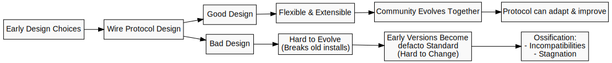

class: center, middle

# PromiseGrid Wire Protocol Design

---

## What is a wire protocol?

A wire protocol is a set of rules that define:

- how data is formatted and transmitted over a network
- how to interpret the data once it is received
- how to handle errors and exceptions
- how to manage connections and sessions
- how to authenticate and authorize agents

---

### Why Wire Protocol Design Matters in Early Development

Early design decisions about the wire protocol can be difficult to
change once systems are in use.  This is because:

- A bad design can make it difficult to evolve the protocol
  without breaking existing installations.
- A bad design can lead early adopters to consider early versions of
  the protocol to be a defacto standard, making evolution difficult
  from a community perspective.

---

### Why Wire Protocol Design Matters in Early Development

---

## PromiseGrid Vision: Decentralized Virtual Machine

PromiseGrid is implemented using a message-passing microkernel architecture:

- Message-passing: agents exchange structured messages
- Microkernel: minimal core, most services run as applications

More on this later.

---

## What is a kernel?

In computer science, a kernel is the core component of an operating
system that:

- manages system resources such as CPU, memory, storage, and I/O devices
- provides a communication interface between hardware and software
- provides a set of services for applications to interact with the
  hardware and network

---

## Conventional (Monolithic) Kernels

Windows and Linux use conventional (monolithic) kernels.  In these
systems, all of the kernel's functionality is implemented in a
monolithic piece of code that runs in "ring 0" of the CPU.  Ring 0
processes have full access and control over the hardware.

In current operating systems, including Linux, MacOS, and Windows,
applications run in "user space" (ring 3) and communicate with the
kernel using system calls such as 'open()', 'read()', and 'write()'.

---

## Microkernels

MacOS and iOS use a microkernel architecture.  In these systems,
the kernel is a small, lightweight component that provides only the
essential services required for communication between hardware and
software, such as:

- Inter-process communication (IPC), usually via message passing
- Low-level hardware access

The rest of the operating system services, such as device drivers,
file systems, and network stacks, run in user space (ring 3) as
separate processes. This separation allows for better isolation,
security, and modularity.  

---

# Fault Tolerance

Microkernels also provide for better failure isolation, as a crash in
one user-space process does not affect the entire system.  

This property of microkernels is important for decentralized systems,
where each agent may be running on a different machine or device and
where the agents are of variable reliability.

---

## Microkernel Message-Passing IPC

Perhaps the most important feature of microkernels is their use of
message-passing for inter-process communication (IPC).  In a
microkernel, instead of system calls like 'open()', 'read()', and
'write()', processes communicate with each other by sending and
receiving messages.  

---

## PromiseGrid as Decentralized Microkernel

Analogies between microkernel architectures and PromiseGrid:

| Feature | Microkernel | PromiseGrid |
|---------|-------------|-------------|
| interprocess communication | message passing within same CPU | grid messages between agents |
| kernel | microkernel | PG kernel running on each grid node |
| services | device drivers, file systems, network stacks | agent services |
| process | user space process | agent |
| storage | local file system | IPFS |
| addressing | memory address | content address (CID) |

---

## PromiseGrid Wire Protocol Overview

Using a microkernel-inspired architecture, the PromiseGrid wire protocol
is based on the following principles:

- message-passing between agents, regardless of their location
- content-addressable storage using CIDs

A 'CID' (Content Identifier) is a unique identifier for content in
IPFS and compatible systems, including Bluesky.  

The protocol hash serves as a versioning mechanism, enabling future
updates without breaking existing implementations.

---

## Key Design Goals
- Future-proof extensibility through hash of protocol documents
- IoT compatibility with minimal message overhead
- Cross-platform execution (WASM, CLI, containers, bare metal)

---

## What is a CID?

A CID (Content Identifier) is a unique identifier for content in
IPFS and compatible systems.  It is a self-describing data structure
that contains information about the content, including:

- the version of the CID (currently CIDv0 or CIDv1)
- the content's multicodec (e.g., raw bytes, DAG-CBOR)
- the content's hash algorithm (e.g., SHA-256, SHA-512)
- the encoding format (e.g., base32, base58)
- the hash of the content itself

Ref: https://proto.school/anatomy-of-a-cid

---

## Core Protocol Components
### Message Structure
- Nested CBOR format
  - `grid` tag (0x67726964)
    - Protocol hash CID
    - Message payload

Tag 0x67726964 ("grid") will be registered with IANA.

The format of the message payload is described in the document(s)
referred to by the protocol hash CID. Protocol documents would
typically be stored in IPFS for ease of retrieval by developers.

Ref:  RFC-8949  https://datatracker.ietf.org/doc/html/rfc8949

---

## Cryptographic Foundations
- Public key infrastructure integrated with CIDs
- Multihash-derived addresses for agent identification
  - TBD whether we use Bluesky-style DIDs or IPFS-style CIDs

---

## What is an agent?

An agent is defined as an entity that can:

- cryptographically sign and send messages
- receive and verify the cryptographic signatures of messages

Agents can be humans, machines, or software processes.

This definition of 'agent' is consistent with that of Promise Theory
(PT) in that "agents cannot make promises on behalf of other agents".

---

## PromiseGrid Agents are a subset of Promise Theory Agents

As PromiseGrid (PG) is a practical implementation of Promise Theory,
the engineering constraints involved in building network and security
protocols mean that we need to choose a reasonable subset of Promise
Theory's definition of an agent.  In particular:

- A simple machine or subatomic particle does not have the mechanisms
  required to cryptographically sign or verify messages.
  - So a PG agent cannot be a simple machine or subatomic particle.

This diverges from Promise Theory's definition of an agent.  From the
book "Thinking in Promises", page 9:

  Any agent (person, object, or machine) can harbour intentions. An
  intention might be something like “be red” for a [simple] light
  [...] When an intention is publicly declared to an audience (called
  its scope) it then becomes a promise.

---

## IoT Integration Strategy
### Constrained Device Support
- Example minimum viable agent requirements:
  - Aruino UNO
    - 32KB RAM
    - ability to run sha256 hash algorithm
    - ability to run ed25519 signature algorithm

---

## Decentralized IoT Standard

Is is possible that the grid could serve as a generic IoT network
fabric similar in spirit to the local I2C bus?

- Comparative analysis with MQTT/HTTP bridges
- Grid-as-backbone architecture vs traditional IoT hubs

---

## Next steps

A reasonable next step is to implement a 'hello world' equivalent; an
example of remote execution of a simple function in a CLI demo:

- sender writes a simple WASM module that returns a 'hello world' string
- sender compiles the module and stores it in IPFS, retaining the CID
  of  the module
- sender includes the CID in a message to a recipient
- recipient retrieves the module from IPFS using the CID
- recipient executes the module in a WASM runtime, seeing 'hello world'

---

## Standardization Roadmap

- Start a draft RFC.  
  - This is a prereq for registering the 'grid' tag with IANA.
  - https://www.rfc-editor.org/pubprocess/
- Register 'grid' tag with IANA.  
  - https://www.iana.org/assignments/cbor-tags/cbor-tags.xhtml
- Create protocol documents that can be stored in IPFS and referenced
  by the protocol hash CID.  For example:
  - LLM API
  - wrapped MCP API
  - Scenario tree modeling
  - Personal currencies
  - Advisor/Executor model
  - IoT sensor data, e.g. optical encoder, temperature, humidity, etc.
  - ...

